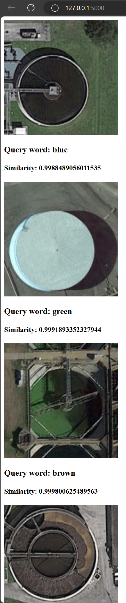

# Composed Image Retrieval for Remote Sensing

Long story short, the embeddings from RemoteCLIP were thrown into pgvector and the weighting scheme described in the paper is implemented in normalize_similiarities.sql.

A very Flask app that implements that query was thrown on AWS EC2 + RDS and was up for a week. The app was similar to the demo.mp4 video. 



## Citations
```
@inproceedings{psomas2024composed,
      title={Composed Image Retrieval for Remote Sensing}, 
      author={Psomas, B. and Kakogeorgiou, I. and Efthymiadis, N. and Tolias, G. and Chum, O. and Avrithis, Y. and Karantzalos, K.},
      booktitle={IGARSS 2024 - 2024 IEEE International Geoscience and Remote Sensing Symposium}, 
      year={2024}
}

@article{Zhou_2018,
   title={PatternNet: A benchmark dataset for performance evaluation of remote sensing image retrieval},
   volume={145},
   ISSN={0924-2716},
   url={http://dx.doi.org/10.1016/j.isprsjprs.2018.01.004},
   DOI={10.1016/j.isprsjprs.2018.01.004},
   journal={ISPRS Journal of Photogrammetry and Remote Sensing},
   publisher={Elsevier BV},
   author={Zhou, Weixun and Newsam, Shawn and Li, Congmin and Shao, Zhenfeng},
   year={2018},
   month=nov, pages={197–209} }
```